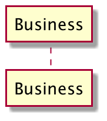

# File Structure and Layers

## Interfaces

In Go callers specify interface. It is lower level packages' responsibility to conform to high level interfaces.

## Layers

### Routing

- responsible for middleware
- encoding, writing out

### Business

`Business` here refers to the layer that provides value to consumers

- returns: serializable structs
- expects: models from data

#### Model

`model` has the interfaces that `business` layer expects

### Data

- returns: models
- type definitions in this layer are decoupled from those in business layer

#### Example

- inmemory package: fake in memory data
- nosql package: meant to connect to database

both will be able to fulfil interfaces required by business layer, but underlying implementation / structural details are encapsulated.